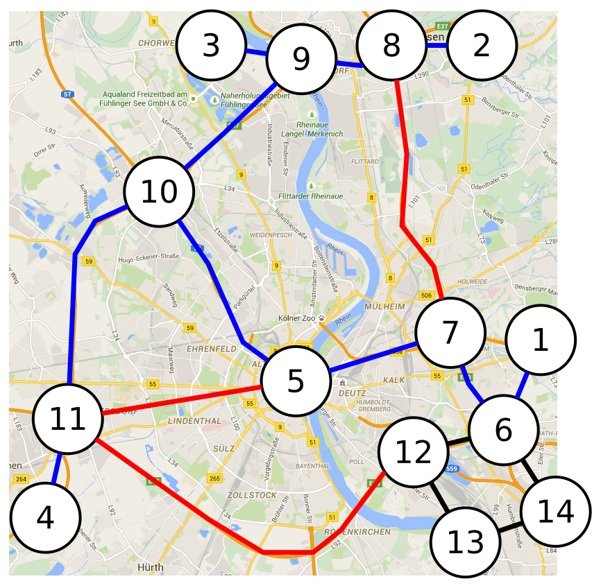

.. _examples:
.. highlight:: python

Examples
========

.. contents:: Contents
    :depth: 3
    :local:

In this chapter we will discuss additional examples, which are intended to provide the user with a broader perspective of reloop's applications.
If you have not already visited the _tutorial: it is advised to do so first.

Stackelberg Games
-----------------------------

We now turn to compressed optimization using a novel application of relational optimization: security games.

Lifted Optimization: Can you trick the police?
**********************************************

As can be seen from the Sudoku example, relational LPs share many common features with 
probabilistic relational models. It is thus natural to expect that some techniques developed 
for inference in probabilistic relational models could also apply to solving relational LPs. One such technique
is lifted inference using color-passing. In Markov Random Fields, color-passing can be used as 
a preprocessing step to Belief Propagation, where it detects nodes that would send and receive
identical messages. These nodes are then grouped so that redundant computations are avoided. 
In linear programs, color-passing can reduce the size of the LP regardless of the solver being used.

In RELOOP, color-passing is implemented by means of wrapping the highly efficient graph automorphism package Saucy (implemented in C),
which uses color-passing as a heuristic for orbit computation. The interface to Saucy offers both options: either terminate Saucy
after color-passing, outputting the coarsest equitable partition of the LP, or run the orbit solver fully
and output the orbits under the automorphism group of the LP. 

RELOOP offers two ways to access Saucy. The first is a direct wrapper that allows the user to compute 
coarsest equitable and orbit partitions of arbitrary colored graphs (matrices). The second, which we will discuss here,
is integrated in the solver interface. Calling:: 
	
	model.solve(lifted = True)

will trigger RELOOP to automatically generate the necessary representation to lift the LP, pass it to Saucy, and apply the 
result to generate a smaller but equivalent LP. Additionally, one may supply the option::

	lifted_orbits = True 

to lift according to the orbit partition. 

In the context of RELOOP, our vision is that lifting could serve as a form of ``compiler optimization'' for mathematical programming.
We envision situations where a user could write a simple mathematical program, which due to its simplicity contains a lot of redundancy.
Removing this redundancy could require significant user effort, such as extra code to avoid computing the same patterns more than once. 
Instead, the lifting algorithm could do that automatically, relieving the user from that responsibility. 

A Relational Linear Program for Stackelberg Games
**************************************************
To illustrate this, consider to compute the optimal placement of traffic checkpoints over a road network as
to maximize their coverage. Consider the network shown in the Figure above inspired by the ring network around the German city of
Cologne. Suppose that in this network, nodes :math:`T = \{1, 2, 3, 4\}` act as sources and sinks of traffic. I.e., a driver might start in any one of
them and her objective is to reach one of the remaining nodes of this set. On the other hand, the traffic police has a small number :math:`k` of
patrols, which it can position on any of the edges of the graph. The objective is to minimize the number of drivers that can avoid the control. 

We model this situation as a Stackelberg game, see e.g [conitzerS06]_ . A Stackelberg game is typically played between a leader and a follower. The game proceeds as follows: the leading player must act first and pick an action out of a finite set :math:`A_L` and commit to it. In our case, the leading player is the traffic police, and their actions are to pick a subset of :math:`k` edges of the graph to position patrol on. The follower (the driver in our case) may then observe the leader's action (say, via a social traffic app like Waze) and use that knowledge for picking her own action from a set :math:`A_F`. In this case, :math:`A_F` is the set of all simple paths between nodes of :math:`V`. Finally, the game rewards both players according their utility functions :math:`u_L, u_F: A_L \times A_F \rightarrow \mathbb{R}`. For the purposes of this example, the follower has negative utility if she chooses a road with a checkpoint, while the police's utility is positive. Due to space constraints, we omit the details on how to construct the utility functions. 

Our goal is now to compute the optimal mixed strategy for the traffic police. This problem can be cast as the Mixed Integer Quadratic Program (MIQP) shown on Figure~\ref{fig:sgp}. While we will not go into the details of how this program is constructed (we refer the reader to [pitaJMOPTWPK08]_ instead), we note that this program has :math:`3` sets of variables. First, we have the leader mixed strategy, :math:`\sigma`, which is constrained to be a probability distribution over the leader's actions. We have also binary indicator variable :math:`q \in \{0,1\}^{|A_F|}` ranging over the follower's actions. Note that the constraint that the components of :math:`q` sum to :math:`1` implies that in any feasible solution exactly one component is :math:`1` and all others are :math:`0`. Observe that if :math:`q` is fixed, the problem is an LP. Finally, we have the variable :math:`v`, which is a slack variable.  

This mathematical program can be solved via MIQP methods or linearized to an MILP. Here we will stick to the conceptually simpler approach of [conitzerS06]_ :
What we will do here instead, is, generate all :math:`|A_F|` many feasible :math:`q`'s and create an LP for each of them. In doing so, we end up with a large number of LPs (relative to the size of the input graph)---recall that :math:`A_F` is the set of all paths from source to sink nodes. However, as we will see, these problems end up being symmetric. To compression the LPs, we combine the disjoint subproblems in one mega-LP and run color-passing on it. Note that this mega-LP now contains :math:`|A_F|` many copies of the decision variable vector :math:`\sigma`, one for each sub-problem. 

We now briefly illustrate how to encode this in RELOOP; details are omitted due to space constraints. To generate the entire mega-LP in one piece,
we use the following code::

	model += RlpSum([I,J], leader_act(I) & foll_act(S),
	          lead_util(I,S) * lead_strat(S,I))
	model += ForAll([S,], foll_act(S),  
	    RlpSum([I,], lead_act(I), lead_strat(S,I))|eq|1)
	model += ForAll([S, I], foll_act(S) & lead_act(I),
	    lead_strat(S,I) |ge| 0)
	model += ForAll([S,], foll_act(S) & foll_act(J),
	    RlpSum([I,], lead_act(I), foll_util(I,J) 
	        * lead_strat(S,I)) |le| bound(S)) 
	model += ForAll([S,J], foll_act(S)&foll_act(J)&Eq(S, J),
	    bound(S) - RlpSum([I,], lead_act(I), foll_util(I,J) 
	        * lead_strat(S,I)) |le|  M)

which is the equivalent to the following LP formulation\:

.. math:: 
	& \text{minimize}_{\sigma, q, v}  \sum_{a\in A_L}\sum_{b\in A_F}q(b)\cdot u_L(a,b)\cdot\sigma(a) \\
	\text{subject to} \quad &  \forall b \in A_F: \quad 0 \leq \left(v - \sum_{a\in A_L} u_F(a,b)\sigma(a)\right) \leq (1-q(b))\cdot M \;, \\
	&\forall a \in A_L:  \quad 0 \leq \sigma(a) \leq 1 \;, \\
	&\forall b \in A_F:  \quad q(b) \in \{0, 1\}\;, \sum_{a\in A_L} \sigma(a) = 1,\; \sum_{b \in A_F} q(b) = 1, v \in \mathbb{R}\;.

Here, the logical variable :math:`S` essentially index the subproblems. To elaborate further, one can see that the decision predicate `\tt leader\_strategy` has arity :math:`2` (whereas :math:`\sigma` is :math:`|A_L|`-dimensional as it ranges over leader actions). This happens as we want to express all :math:`|A_F|` copies of `\sigma` across all subproblems in one problem. Thus, the first variable of :math:`\tt leader\_strategy` ranges over the follower actions (since we have essentially one LP per follower action) and gives us the copy of :math:`\sigma` relevant to the subproblem. 

We also give an excerpt of the LogKB that defines the follower and leader strategies (the rules have been simplified for clarity, e.g., we omit rules that prevent cycles in paths)::

	#follower actions
	path(X,Y,P) <= node(X) & node(Y) & node(Z) & adjacent(X,Z) & path(Z,Y,P2)
	stPath(X,Y,P) <= stPair(X,Y) & path(X,Y,P)
	foll_act(P) <= stPath(X,Y,P)
	#leader actions
	edgeSet(K,E) <= findall("innerEdge(X,Y)",X) & combinations(K,X,E)
	lead_act(E) <= resources(R) & edgeSet(R,E) 

Now, we can solve the resulting relational model for, say,  :math:`k = 3` checkpoints with symmetry compression enabled. We get :math:`102` subproblems, each with :math:`287` decision variables and :math:`491` constraints. The mega-LP has thus :math:`29.274` decision variables and `50.082` constraints. Its constraint matrix has :math:`6.069.816` nonzero elements. Color-passing reduces the size of the LP to :math:`5.763` variables, :math:`11.016` constraints. The lifted constraint matrix has :math:`643.651` nonzero elements, a :math:`9` time reduction, 
even though the input graph is asymmetric. This renders the problem well within the scope of modern off-the-shelf commercial solvers. 

Linear Programming Support Vector Machine
------------------------------------------

We conclude this section with a more practical example from machine learning to illustrate the runtime performance of grounding LPs. We would like to classify documents from the CORA data set using an `l_\infty`-SVM. This problem has an LP formulation, see [kersting2015]_ for details about the method and the data::

	# objective
	model += -r() + c * RlpSum({I}, b_label(I, Q), slack(I))
	# constraints
	model += ForAll({I,Z}, b_paper(I, Z),
	                label(I) * (RlpSum({X,J}, b_paper(X, J), weight(X) * label(X) * kernel(Z, J)) + b()) + slack(I) >= r())
	model += ForAll({X}, b_paper(X, I), weight(X) <= 1)
	model += ForAll({X}, b_paper(X, I), -weight(X) <= 1)
	model += r() >= 0
	model += ForAll({I}, b_label(I, Z), slack(I) >= 0)

Our training examples consist of bag-of-words representations of the abstracts of papers. We compute an RBF kernel with Numpy for every pair and insert the resulting list of (paper, paper, kernel value) tuples into the postgreSQL table ''kernel''. We grounded the model for :math:`170`, :math:`258`, :math:`428`, :math:`840` and :math:`1.699` papers in a virtual machine on a :math:`3,4` GHz :math:`i7` desktop with :math:`8` GB RAM. This yielded problems with :math:`29.921`, :math:`681.13`, :math:`184.033`, :math:`710.641`, and :math:`2.896.796` non-zero entries in the constraint matrix. The running times were (rounded) :math:`7` s, :math:`16` s, :math:`36` s, :math:`105` s, and :math:`460` s with more than :math:`90` \% of spent in PostgreSQL (:math:`10`\% for the RELOOP overhead). While this may not be the most efficient way to approach this problem, it shows that our grounder (described in the next section) adds little overhead over what is necessary to retrieve the data. It also motivates further research into a more direct integration of Numpy into the RELOOP system.  

.. [conitzerS06] Conitzer, V., and Sandholm, T. 2006. Computing the optimal strategy to commit to. InProceedings of the 7th ACMConference on Electronic Commerce(EC-2006), 82–90.

.. [pitaJMOPTWPK08] Pita,  J.; et.al. 2008. Deployed  ARMOR  protection:  the  application  of  a  game theoretic model for security at the los angeles international airport. InProceedings of the 7th International Joint Conference on Autonomous Agents and Multiagent Systems (AA-MAS 2008, 125–132).

.. [kersting2015] Kersting, K.; Mladenov, M.; and Tokmakov, P.  2015.  Re-lational linear programming. Artificial Intelligence Journal. In Press, Available Online.