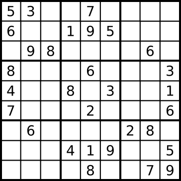
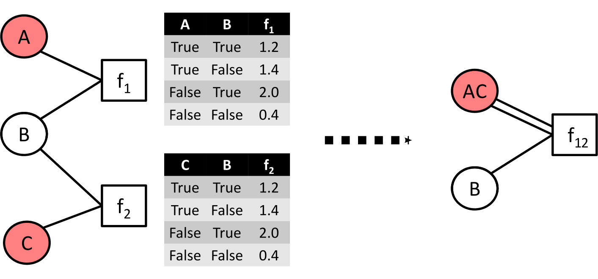

.. _tutorial:
.. highlight:: python

Tutorial
========

.. contents:: Contents
    :depth: 3
    :local:

Relational Linear Programming
-----------------------------

Mathematical programs (MPs) are often specified using algebraic modelling languages such as AMPL. They simplify MP definition by allowing to use algebraic
notation instead of matrices and define an objective and constraints through parameters whose domains are defined in a separate file,
thus enabling separating the model from its instances. That is, algebraic modeling languages such as AMPL allow one to write down the problem description
in a declarative way. They free the user from engineering instance specific MPs while capturing the general properties of the problem class at hand.
However, they do not provide logically parameterized definitions for the arithmetic expressions and for the index sets. RLP, which we will introduce now,
features exactly this.

Sudoku
******

`Sudoku <https://en.wikipedia.org/wiki/Sudoku>`_ is a numerical puzzle in which one is presented with a 9x9 square grid subdivided into 3x3 boxes with 3x3 squares each such as the one in the figure below. 

   A sudoku problem.

As a starting condition, the grid is partially populated with numbers from 1 to 9. The objective of the puzzle is to fill the remaining empty squares with numbers from 1 to 9 such that: 

* no number occurs twice in a row, 
* no number occurs twice in a column, and, 
* no number occurs twice in a box. 

A sudoku puzzle can be solved by means of linear programming. To do so, we construct an assignment LP. To start, we introduce a decision variable ``fill(X,Y,N)`` for every pair of row and column indices X,Y and every number N. The intent of these variables, which we will bound between 0 and 1, will be to indicate where the number N is filled in the empty square X,Y. E.g., having ``fill(9,7,1) = 1`` in our solution represents that the square in the ninth row and seventh column receives the number 1.

Our first job is to ensure that exactly one number can be assigned to a square, hence our first LP constraint is  

.. math:: 
    \forall X,Y \in \{1,\ldots,9\}: \sum_{N \in \{1,\ldots,9\}} \mathtt{fill(X, Y, N)} = 1 \;. 

This ensures that the solution is a valid assignment. Next, we want to satisfy the sudoku constraints. Hence we add

.. math:: 
    \forall Y,N \in \{1,\ldots,9\}: \sum_{X \in \{1,\ldots,9\}} \mathtt{fill(X, Y, N)} = 1

to require that each number occurs exactly once in a row; similarly,

.. math:: 
    \forall X,N \in \{1,\ldots,9\}: \sum_{Y \in \{1,\ldots,9\}} \mathtt{fill(X, Y, N)} = 1  

ensures that numbers occur exactly once in a column. The final requirement, that no number occurs twice in a box, is expressed as 

.. math:: 
    \forall B \in \mathtt{Boxes},N \in \{1,\ldots,9\}: \sum_{(X,Y) \in B} \mathtt{fill(X, Y, N)} = 1\; .  

Here, B is understood to be the set of indices of the squares that are in the respective box. E.g., {(4,4), (4,5), (4,6), (5,4), (5,5), (5,6), (6,4), (6,5), (6,6)} is the box in the center of the grid.  
The final constraint is that the ``fill`` variables must be nonnegative

.. math:: 
    \forall X,Y,N \in \{1,\ldots,9\}: \mathtt{fill(X,Y,N)} \geq 0\;.

The conjunction of all these constraints forms a linear program whose feasible set happens to be the convex hull of integral vectors. Thus if we were to solve it via the Simplex method, we would obtain a solution in which the ``fill`` variables have values of either 0 or 1, so we can read off the assignment. 

We will now show how to use reloop’s RLP language to construct and solve this model.

A Relational Linear Program for Sudoku
**************************************
(The running code for this example can be found in :ref:`sudoku.py<sudoku>`.)

We start by importing the necessary reloop components::

    from reloop.languages.rlp import *
    from reloop.languages.rlp.grounding.block import BlockGrounder
    from reloop.languages.rlp.logkb import PyDatalogLogKb
    from reloop.solvers.lpsolver import CvxoptSolver
    

Let us shortly explain what these are. In order to create an RLP model, we need three objects -- a logical knowledge base, a solver and a grounder. The :ref:`logkb interface<reloop.languages.rlp.logkb>` provides RLP with means to query the relational database/reasoning engine where our data is stored. Currently, we support pyDatalog, PostgreSQL, SWI Prolog and ProbLog. For the current example we will use pyDatalog. The :ref:`solver interface<python_solvers>` interfaces RLP to a linear programming solver such as glpk, CXOPT or gurobi. Finally, the :ref:`grounder<reloop_grounding>` is an object that implements a strategy of parsing the relational LP constraints and querying the logkb in order to convert the RLP to matrix form, which the solver understands.   

We now instantiate the three objects in question::

    logkb = PyDatalogLogKb()
    grounder = BlockGrounder(logkb)
    solver = CvxoptSolver(solver_solver='glpk')

The option ``solver_solver = 'glpk'`` is a passtrhough argument that tells CVXOPT to use glpk, since we need to solve the sudoku LP with a simplex method (see :ref:`solver doc<python_solvers>` for further details). We are ready to instantiate the model::

    model = RlpProblem("play sudoku for fun and profit",
                       LpMaximize, grounder, solver)

The model takes as arguments a grounder (the logkb is accessed through the grounder), a solver and a sense of the objective, either LpMinimize or LpMaximize. For this example it does not really matter.

Before we start defining constraints, we will declare our predicates and symbols. 
We need some symbols to serve as logical variables. These are defined with ::
    
    I, J, X, U, V = sub_symbols('I', 'J', 'X', 'U', 'V')

We move on to predicate definitions. Reloop has two different kinds of predicates, 

* Numeric predicates (essentially functions) that will return a numeric value, e.g. pred('a', 'b') -> 100. In the logkb, this numerical atom is stored as pred('a', 'b', 100).
* Boolean predicate that will return a boolean value, e.g. pred('a', 'b', 100) -> True.

In our sudoku LP, we have the following predicates::  

    num = boolean_predicate("num", 1)
    boxind = boolean_predicate("boxind", 1)
    box = boolean_predicate("box", 4)
    initial = boolean_predicate("initial", 3)
    fill = numeric_predicate("fill", 3)

Predicate declaration in RLP takes two arguments - a predicate name and an arity. An RLP predicate can be a variable predicate, meaning that each of its atoms in the Herbrand basis may appear in the LP as a decision variable. If a predicate is not a variable predicate, it must be interpreted in the knowledge base, either extrinsically by facts or intrinsically by rules.  

Our variable predicate is ``fill``. We let the model know this by::

    model.add_reloop_variable(fill)

The other predicates will be interpreted in the knowled base. Since we leave the knowledge base discussion for the end of this example, let us briefly mention what these predicates are supposed to mean. 

``num`` will evaluate to true if the argument is an integer from 1 to 9. This will be used for grid coordinates and for numbers to fill in the squares. ``boxind`` holds the numbers from 1 to 3. This will be used for the coordinates of the boxes. E.g., box 1,1 is the upper-left box in the grid, while box 3,3 is the lower-right. The predicate ``box`` takes 4 arguments - the two coordinates of a square and the two coordinates of a box. ``box(x,y,u,v)`` evaluates to true if the square at x,y is in the box at u,v. E.g., ``box(7,8,3,3)`` is true since at row 7 and column 8 is in the lower-right box. Finally ``initial`` tells us how squares are filled in the initial grid state. E.g. ``initial(1,1,5)`` is true in the grid of the figure.   

We now have everything in order to introduce the RLP constraints:: 

    # each cell receives exactly one number
    model += ForAll([I, J], num(I) & num(J), RlpSum([X, ], num(X), fill(I, J, X)) | eq | 1)

    # each number is encountered exactly once per row
    model += ForAll([I, X], num(I) & num(X), RlpSum([J, ], num(J), fill(I, J, X)) | eq | 1)

    # each number is encountered exactly once per column
    model += ForAll([J, X], num(J) & num(X), RlpSum([I, ], num(I), fill(I, J, X)) | eq | 1)

    # each number is encountered exactly once per box
    model += ForAll([X, U, V], num(X) & boxind(U) & boxind(V), RlpSum([I, J], box(I, J, U, V), fill(I, J, X)) | eq | 1)

    # nonnegativity
    model += ForAll([I, J, X], num(X) & num(I) & num(J), fill(I, J, X) | ge | 0)

    # initial assignment
    model += ForAll([I, J, X], initial(I, J, X), fill(I, J, X) | eq | 1)

The default way to add constraints to a model is by the overloaded addition operator. Constraints can be defined through the ``ForAll`` function, which takes as arguments a list of query symbols X, a logical query L(X,Y), and a parametrized relation R(X) (a relation is a linear equality or inequality), where the query symbols appear as parameters. The semantics of ``ForAll`` are as follows: the query L(X,Y) is executed and projected onto X (i.e., we ask the knowledge base for the tuples of ``answer(X) <- L(X,Y)`` with duplicate elimination). For every tuple t in ``answer(X)``, we instantiate a ground constraint with the relation R(t). E.g., the constraint ``ForAll([X], num(X), fill(1,1,X) |ge| 0)`` is equivalent to the ground constraints ``fill(1,1,1) >= 0,...,fill(1,1,9) >= 0``.

Constraints can also be added directly by ``model += R`` without ``ForAll``, however, no free variables should occur in ``R``. E.g. ``model += fill(1,1,1) |ge| 0`` is acceptable.    

We will now discuss relations. A relation is an expression of the form A rel B, where A and B are linear expressions and rel is one of `|eq|``, ``|ge|``/``>=``  and ``|le|``/``<=``. A linear (in terms of the RLP decision variables) expression may contain addition of linear terms, multiplication of linear terms with a non-variable numberic predicate, or an`` RlpSum``. An ``RlpSum`` is a first-order expression that generates a sum based ot the result of a query. The syntax is similar to ``ForAll``. E.g.m "RlpSum([X], num(X), fill(1,1,X))" is equivalent to ``fill(1,1,1) + ... + fill(1,1,9)``.

Finally, we may add an objective by adding a linear term (not a relation) to the model::
    
    # objective
    model += RlpSum([X, ], num(X), fill(1, 1, X))

This is done here for illustration purposes as this LP does not need an objective. 

Together with a logical knowledge base, effectively a logical program consisting of logical facts and rules, these relational rules induce a ground linear program which can be solved. We show how to how to create a knowledge base in the next section. 

A Logical Knowledge Base for Sudoku
***********************************

As alrady noted, we will use pyDatalog as a knowledge engine. 

Our first order of business is to assert the facts. We can do so by::

    for u in range(1, 10):
        pyDatalog.assert_fact('num', u)

    for u in range(1, 4):
        pyDatalog.assert_fact('boxind', u)

    pyDatalog.assert_fact('initial', 1, 1, 5)
    pyDatalog.assert_fact('initial', 2, 1, 6)
    pyDatalog.assert_fact('initial', 4, 1, 8)
    pyDatalog.assert_fact('initial', 5, 1, 4)
    pyDatalog.assert_fact('initial', 6, 1, 7)
    pyDatalog.assert_fact('initial', 1, 2, 3)
    pyDatalog.assert_fact('initial', 3, 2, 9)
    pyDatalog.assert_fact('initial', 7, 2, 6)
    pyDatalog.assert_fact('initial', 3, 3, 8)
    pyDatalog.assert_fact('initial', 2, 4, 1)
    pyDatalog.assert_fact('initial', 5, 4, 8)
    pyDatalog.assert_fact('initial', 8, 4, 4)
    pyDatalog.assert_fact('initial', 1, 5, 7)
    pyDatalog.assert_fact('initial', 2, 5, 9)
    pyDatalog.assert_fact('initial', 4, 5, 6)
    pyDatalog.assert_fact('initial', 6, 5, 2)
    pyDatalog.assert_fact('initial', 8, 5, 1)
    pyDatalog.assert_fact('initial', 9, 5, 8)
    pyDatalog.assert_fact('initial', 2, 6, 5)
    pyDatalog.assert_fact('initial', 5, 6, 3)
    pyDatalog.assert_fact('initial', 8, 6, 9)
    pyDatalog.assert_fact('initial', 7, 7, 2)
    pyDatalog.assert_fact('initial', 3, 8, 6)
    pyDatalog.assert_fact('initial', 7, 8, 8)
    pyDatalog.assert_fact('initial', 9, 8, 7)
    pyDatalog.assert_fact('initial', 4, 9, 3)
    pyDatalog.assert_fact('initial', 5, 9, 1)
    pyDatalog.assert_fact('initial', 6, 9, 6)
    pyDatalog.assert_fact('initial', 8, 9, 5)

Second, we add the rules. In our case we have only one::

    pyDatalog.load("""
        box(I, J, U, V) <= boxind(U) & boxind(V) & num(I) & num(J) & (I > (U-1)*3) & (I <= U*3) & (J > (V-1)*3) & (J <= V*3)
    """)

This rule defines the ``box`` predicate, which tells us if a square belongs to a box by checking if its coordinates belong to the range of the box.

Solving Sudoku
**************

Having created a logKB, we are ready to solve the linear program. We do so and print the output::
     
    model.solve()

    sol = model.get_solution()
    print "The solutions for the fill variables are:\n"
    for key, value in sol.iteritems():
        if round(value, 2) >= 0.99:
            print key, "=", round(value, 2)

This produces the following output: ::

        GLPK Simplex Optimizer, v4.45
    1082 rows, 729 columns, 3674 non-zeros
          0: obj =   0.000000000e+00  infeas =  3.530e+02 (353)
    *   446: obj =  -1.000000000e+00  infeas =  0.000e+00 (108)
    OPTIMAL SOLUTION FOUND
    The solutions for the fill variables are:

    fill(1,4,6) = 1.0
    fill(7,1,9) = 1.0
    fill(6,2,1) = 1.0
    fill(9,9,9) = 1.0
    fill(2,7,3) = 1.0
    fill(1,7,9) = 1.0
    fill(2,6,5) = 1.0
    fill(7,3,1) = 1.0
    fill(9,3,5) = 1.0
    fill(3,7,5) = 1.0
    fill(3,9,7) = 1.0
    fill(5,8,9) = 1.0
    fill(2,4,1) = 1.0
    fill(5,9,1) = 1.0
    fill(9,6,6) = 1.0
    fill(1,9,2) = 1.0
    fill(8,4,4) = 1.0
    fill(8,7,6) = 1.0
        ...

The complete running example can be found :ref:`here<sudoku>`.

Further Examples
****************
Further examples can be found at :ref:`the examples section<examples>`.
Equitable Partitions and Lifted Linear Programming
--------------------------------------------------

Next to modeling languages, reloop offers tools for efficiently lifting and solving optimization problems produced by these languages (and not only). In the lifted solvers provided, efficiency is gained by exploiting redundancy in the structure of the problem. Our main tool for redundancy discovery are the so-called equitable partitions of matrices. In the following, we will look at computing equitable partitions of matrices with the tools of reloop, as well as  lifting factor graphs, solving linear equations and linear programs in a lifted fashion.   

Equitable Partitions of Matrices
********************************

Given is a tuple :math:`L=(\mathbf{A},\mathbf{b},\mathbf{c})`, where :math:`\mathbf{A}\in \mathbb{R}^{m\times n}, \mathbf{b}\in \mathbb{R}^{m}` and :math:`\mathbf{c}\in \mathbb{R}^{n}`. We say that a partition :math:`{\cal P} = \{P_1,\ldots,P_p; Q_1,\ldots,Q_q\}` of :math:`L=(\mathbf{A},\mathbf{b},\mathbf{c})` is **equitable** if the following conditions hold. 

* For any two columns :math:`i,\; j` in the same class :math:`P`, :math:`\mathbf{c}_i = \mathbf{c}_j`. For any two rows :math:`i,\; j` in the same class :math:`Q`, :math:`\mathbf{b}_i = \mathbf{b}_j`;

* For any two columns :math:`i,\; j` in the same class :math:`P`, and for any constraint class :math:`Q` and real number :math:`r`: 

.. math::
    |\{k \in Q\ :\ \mathbf{A}_{ik} = r \}| = |\{l \in Q\ :\ \mathbf{A}_{jl} = r \}|\;.

* Analogously,  for any two rows :math:`i,\; j` in the same class :math:`Q`, and for any constraint class :math:`P` and real number :math:`r`:

.. math::
    |\{k \in P :\ \mathbf{A}_{ki} = r \}| = |\{l \in P :\ \mathbf{A}_{lj} = r \}|\;.

Reloop provides an interface to the highly efficient code of `Saucy <http://vlsicad.eecs.umich.edu/BK/SAUCY/>`_ for the computation of equitable partitions of matrices. Currently, we can compute the coarsest equitable partition of a matrix, as well as its orbit partition. We will now show how to compute equitable partitions. We will now illustrate the basic concepts by lifting a factor graph so we can later run lifted belief propagation. 

Lifting an MRF Factor Graph
***************************

Suppose we are given the following factor graph (to the right).  

We have two factors with identical tables, two observed variables (:math:`A` and :math:`B`) and one unobserved variable. Our aim is to compute a lifted factor graph (on the right) so we can run lifted belief propagation. We will now show how this is done in reloop.

We begin by importing the Saucy wrapper from reloop ::

    import reloop.utils.saucy as saucy

We will also need ``scipy.sparse`` and ``numpy``: ::

    import scipy.sparse as sp
    import numpy as np

Now we must figure out how to represent our factor graph in a way that Saucy can understand. Let us make a few observations. 

First, it is a bipartite graph. This suggest that we can encode it in a rectangular matrix, where the rows represent factors and the columns represent variables. I.e., we have :math:`\mathbf{A}_{fX} \neq 0` if variable :math:`X` is connected to factor :math:`f` and :math:`\mathbf{A}_{fX} = 0` otherwise. Now we need to figure out what the actual entry for an edge would be. The subtlety lies in the fact that our factor tables are not symmetric: :math:`f_1(A = \mathrm{True}, B = \mathrm{False}) \neq f_1(A = \mathrm{False}, B = \mathrm{True})`. In other words, the first and second positions of the factor are not exchangeable. To reflect this in the representation, we will set :math:`\mathbf{A}_{fX} = 1` if :math:`X` is connected to the first position of :math:`f` and :math:`2` if it is in the second position. Since these numbers are internally intepreted as colors, the actual choice of numbers is not important, as long as compatible positions (arguments of the factor that can be permuted) receive the same numbers, and incompatible positions receive different numbers.

Second, two of the variables are observced, one is not. We do not want to group observed and unobserved variables, so we need to distinguish them. We can do so by using the :math:`\mathbf{c}`-vector (depending on the possible states that the variables can take, we may need to use even more colors --- this depends on the MRF; for now we assume they are binary), assigning a different value for :math:`B`. Also, in this case our two factor tables are identical, but were they different, we would need to prevent the factors for being grouped together. We could accomplish this in the same manner, by using the :math:`\mathbf{b}`-vector.

We thus end up with the following representation of the factor graph:

.. math::

      \mathbf{A}^F = \begin{bmatrix}
           1 & 2 & 0           \\[0.3em]
           0 & 2 & 1            \\[0.3em]
           \end{bmatrix}\;,
        \mathbf{b}^F = \begin{bmatrix}
       0\\
       0\\
     \end{bmatrix} \text{ and } \mathbf{c}^F =       \begin{bmatrix}
       1\\
       0\\
       1\\
     \end{bmatrix}\; . 

We can now input this in saucy. All our data needs to be in coo_matrix format, and ``b`` and ``c`` must be column vectors:  ::

    A = sp.coo_matrix([[1, 2, 0], [0, 2, 1]])
    b = sp.coo_matrix([0,0]).T
    c = sp.coo_matrix([1,0,1]).T

We can now call the equitable partition function and print the result: ::

    [rowpart, colpart] = saucy.epBipartite(A, b, c, 1)
    print "==="
    print "row classes: ", rowpart
    print "column classes: ", colpart 

Note that the ``1`` in the last argument of ``epBipartite()`` indicates we are computing the coarsest equitable partition. To compute orbits, we use ``0``.
When ran, this python code (also found at :ref:`lift_factorgraph.py<epFg>`) outputs the following: ::

    entring wrapper with 2 rows, 3 cols and 4 entries.
    row colors: 1
    col colors: 3
    nodes 9
    edges 8
    input file = (null)
    vertices = 9
    edges = 8
    group size = 1.000000e0
    levels = 0
    nodes = 1
    generators = 0
    total support = 0
    average support = -nan
    nodes per generator = inf
    bad nodes = 0
    cpu time (s) = 0.00
    ===
    row classes:  [0 0]
    column classes:  [1 0 1]

After the debug output of Saucy we can read off the partition. For the variable (column classes)  :math:`A` and :math:`C` are placed in class :math:`1`, while :math:`B` is placed in class :math:`0`. Also, both factors (row classes) are in the same class. This is exactly what we expected from the example. 

The actual lifted factor graph construction having the colors follows as in (TODO: Babak's paper).

Note that the actual numbering of the classes is not guaranteed to follow any particular convention. 

Lifting Linear Programs
********************************

Let us consider the following LP:

.. math::
    \operatorname*{minimize}_{[x,y,z]^T \in \mathbb{R}^3}\quad  &\; 0x + 0y + 1z\\ 
    \text{subject to}\quad & \begin{bmatrix}
       1 & 1 & 1           \\[0.3em]
       -1 & 0 & 0            \\[0.3em]
       0 & -1 & 0            \\[0.3em]
       1 & 1 & -1            \\[0.3em]
     \end{bmatrix} 
      \begin{bmatrix}
       x\\
       y\\
       z\\
     \end{bmatrix} \leq 
           \begin{bmatrix}
       1\\
       0\\
       0\\
       -1\\
     \end{bmatrix}\;.

It can be verified that an equitable partition of the above LP is :math:`{\cal P}^0 = \{\{1,2\},\{3\};\{1\}\{2,3\}\{4\} \}` --- meaning that column :math:`c_1` is equivalent to :math:`c_2` but not to :math:`c_3` and rows :math:`r_2` and :math:`r_3` are equivalent, but not rows :math:`r_1` and :math:`r_4`. Using this equitable partition, we can derive a new LP, smaller in size, whose set of solutions is a subset of the solutions of the original one. The method of this reduction is described in detail in (TODO: RLP). In short, we reduce the number of rows by leaving only one row per row-class. Then, we reduce the number of columns by removing all columns in the same class from the LP, then inserting back a single representative column which is their sum.  The lifted LP is thus 

.. math::

    \operatorname*{minimize}_{[{\mathfrak x},z]^T \in \mathbb{R}^2}\quad  &\; 0 {\mathfrak x} + 1z\\ 
    \text{subject to}\quad & \begin{bmatrix}
       2 &  1           \\[0.3em]
       -1  & 0             \\[0.3em]
       2 & -1            \\[0.3em]
     \end{bmatrix} 
      \begin{bmatrix}
      {\mathfrak x}\\
       z\\
     \end{bmatrix} \leq 
           \begin{bmatrix}
       1\\
       0\\
       -1\\
     \end{bmatrix}\;.

Within reloop, lifting LPs is achieved through the ``utils.liftAbc()`` function. The following code snippet shows how. ::

    A = sp.coo_matrix([[1, 1, 1], [-1, 0, 0], [0, -1, 0], [1, 1, -1]])
    b = sp.coo_matrix([1,0,0,-1]).T
    c = sp.coo_matrix([0,0,1]).T

    print "input LP:"
    print "c: " + str(c.todense().T)
    print "b: " + str(b.todense())
    print "A: " + str(A.todense())

    LA, Lb, Lc, compresstime, Bcc = saucy.liftAbc(A, b, c, sparse=True, orbits=False)

    print "lifted LP:"
    print "lifted c: " + str(Lc.T)
    print "Lb: " + str(Lb)
    print "LA: " + str(LA.todense())

(TODO: fix sparsity of b and c)
The minimal working example is found at :ref:`lift_Abc.py<liftAbc>`. Executing this code yields ::

    input LP:
    c: [[0 0 1]]
    b: [[ 1]
     [ 0]
     [ 0]
     [-1]]
    A: [[ 1  1  1]
     [-1  0  0]
     [ 0 -1  0]
     [ 1  1 -1]]
    entring wrapper with 4 rows, 3 cols and 8 entries.
    row colors: 3
    col colors: 5
    nodes 15
    edges 16
    input file = (null)
    vertices = 15
    edges = 16
    group size = 1.000000e0
    levels = 0
    nodes = 1
    generators = 0
    total support = 0
    average support = -nan
    nodes per generator = inf
    bad nodes = 0
    cpu time (s) = 0.00
    refinement took:  0.01 seconds.
    lifted LP:
    lifted c: [[0 1]]
    Lb: [[-1]
     [ 0]
     [ 1]]
    LA: [[ 2 -1]
     [-1  0]
     [ 2  1]]

We can read off the lifted LP at the bottom of the output. Note that while the LP agrees with what we expected, the order of the inequalities is different (first and third are switched). This is an artifact of the implementation. It does not, however, change the feasible region of the LP.
